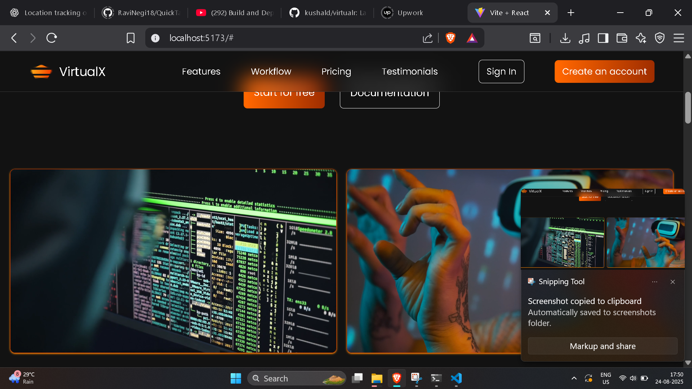

# React + Tailwind Landing Page

A modern landing page built with **React**, **Vite**, and **Tailwind CSS**.  
This project demonstrates a responsive design, clean UI, and reusable components suitable for portfolio or startup projects.
 ## live Demo:   https://pixellanding.netlify.app/
## 🚀 Features
- Fully responsive layout for mobile, tablet, and desktop
- Clean and modern UI design
- Reusable React components for easy scalability
- Fast development with Vite's hot module replacement

## 🛠️ Tech Stack
- **React** – Frontend library
- **Vite** – Development server & build tool
- **Tailwind CSS** – Utility-first CSS framework

## ⚡ Getting Started

### Clone the repository
```bash
git clone https://github.com/RaviNegi18/landing-page-react-tailwind.git
cd react-tailwind-landing-page


##Demo



